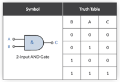
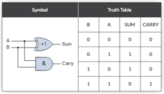
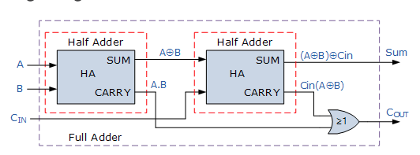
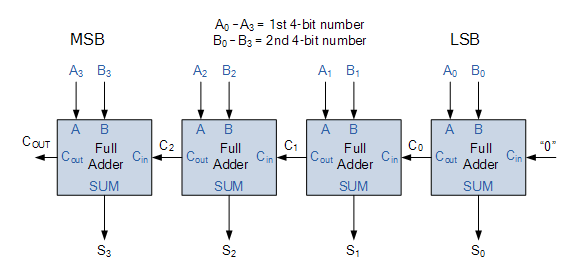

On the [Alloy Mailing List][1] Hillel Wayne posted some linke to examples from the site
[CLOUDBOOTUP](https://cloudbootup.com/post/4-bit-adder-in-alloy-and-typescript.html). I
love Alloy models so I took a peek. This weekend I had some time left and this is a
bit like gaming for me. The reason I wanted to do one myself is that I am a sucker for the
readability of Alloy models. Making a model is always taking time but reading should
be almost effortless. Too many comments and text can actually make things harder to
understand and some newer, not so well known, constructs can make a significant difference.
The (Half)Adder problem is a quite simple logic problem but also not trivial. Also,
I found an [interesting site][2] that had nice pictures and explained the hardware quite
well.

This blog is written in Alloytools using the _markdown_ mode. You can find it on
[github](...) and play with it.

## Prolog

Alloy requires includes to be at the top. We need this later but we're forced to put
this at the top.

```alloy
	open util/ordering[Adder]
```
## Hardware

I am actually a closet hardware engineer so making a half adder is close to my heart. To
make a multi-bit adder, we need an _adder_ component we can cascade. An adder consists
of two _half adders_ and a _half adder_ uses logic gates.

### Logic Gates

So lets start with the logic gates. We model the gates as Alloy _functions_. These
functions take a _bit_, where a bit is either 0 or 1. We use an `enum` for bits
because using `Int` to represent a bit explodes the state space.  `I` is 1 and
`O` is 0.
```alloy
	enum bit    {I,O}
	fun AND[a,b : bit ] : bit { (a=I and b=I) => I else O }
```
Modeling is hard so lets test if our functions are correct. Logic gates have a _truth
table_. A truth table is a table that takes all combinations of inputs and provides
the output. This is how an `AND` gate looks like



We can ask Alloy to generate the truth table of a function with _set comprehension_, or in the
case of Alloy, _relation comprehension_. We can then compare the output of this comprehension
to a fixed truth table.
```alloy
	check AND {
		{ a,b,out : bit | out=AND[a,b] } = 
			O -> O -> O +
			O -> I -> O +
			I -> I -> I +
			I -> O -> O		
	}
```
If you run `check AND` from the `Execute` menu you will find out that there is no counter example.
(This is reported in the log on the right.) 

We can add checks for XOR and OR as well.
```alloy
	fun OR [a,b : bit ] : bit { (a=I or  b=I) => I else O }
	fun XOR[a,b : bit ] : bit { (a!=b       ) => I else O }
	check OR_XOR {
		{ a,b,out : bit | out=OR[a,b] } = 
			O -> O -> O +
			O -> I -> I +
			I -> I -> I +
			I -> O -> I		
		{ a,b,out : bit | out=XOR[a,b] } = 
			O -> O -> O +
			O -> I -> I +
			I -> I -> O +
			I -> O -> I		
	}
```

## Half Adder

A half adder is a logical circuit that performs an _addition_ operation on two bits. The half 
adder produces a _sum_ and a _carry_ bit.



Since we now have 2 outputs we can no longer use a function. We therefore create a `sig`.
```alloy
	sig HalfAdder {
	    A, B        : bit,
	    SUM         : bit,
	    CARRY       : bit
	} {
	    XOR[A,B]    = SUM
	    AND[A,B]    = CARRY
	}
```
Since we already have th truth table we can verify it:
```alloy
	check halfadder {
		all ha : HalfAdder | ha.A -> ha.B -> ha.SUM -> ha.CARRY in 
	            O->O->O->O +
	            O->I->I->O +
	            I->O->I->O +
	            I->I->O->I
	}
```

## Adder
So now we have a half adder and we've shown that it exhibits the proper truth table. We
can now take two half adders and combine them in a full adder:



```alloy
	sig Adder {
	    A, B, CIN     : bit,
	    SUM, CARRY    : bit,
	    disj ha1, ha2 : HalfAdder
	} {
	    A       = ha1.A
	    B       = ha1.B
	    ha1.SUM = ha2.A
	    CIN     = ha2.B
	
	    OR[ha1.CARRY,ha2.CARRY] = CARRY
	    ha2.SUM                 = SUM
	}
	fact ExclusiveHalfAdders{
	    all ha : HalfAdder  | one (ha1+ha2).ha
	}
```
The fact `ExclusiveHalfAdders` is there to ensure that we use each half adder only once.

The truth table of the adder is as follows:

```alloy
	check halfadder {
	    all a : Adder| a.CIN -> a.B -> a.A -> a.SUM -> a.CARRY in 
	    --  CIN B A SUM CARRY
	        O->O->O->O->O +
	        O->O->I->I->O +
	        O->I->O->I->O +
	        O->I->I->O->I +
	        I->O->O->I->O +
	        I->O->I->O->I +
	        I->I->O->O->I +
	        I->I->I->I->I  
	} for 2 but exactly 1 Adder
```


## A Word Adder

We can combine the Adder now into adding multiple bits. This requires us to wire them 
together so that the the CIN (Carry IN) is wired to the previous adder's CARRY pin. This
looks as follows for a 4-bit ripple-carry adder:



To make this work we need a type to represent our input. In the hardware world this is
generally called a _word_. We can represent this as a _seq bit_.
```alloy
	let word    = seq bit
```
We can order the Adder signatures so that we have a clear `prev` and `next` adder. This ordering
then allows us to wire the adders into a ripple carry adder. However, it is then convenient 
to represent our adders as a seq as well. The `word` for the two inputs, the `word` for the output
and the adders in the ripple carry adder then have the same cardinality or size.

We can convert an ordered signature to a seq by making the index equal the number of previous elements.
```alloy
let orderedtoseq[A] = { i: Int, a : A | i = # a.prevs }
```
We're now ready to test our code. To see if this works we create a predicate that adds two
words `bv1` and `bv2` into `out`. We treat the CARRY of the last adder is the overflow bit.
```alloy
pred multibit[ bv1, bv2 : word, out : word, overflow: bit, adders : seq Adder ] {

    # out = # Adder
    # out = # bv1
    # out = # bv2

    adders =  orderedtoseq[Adder]
    first.CIN = O
    all adder : Adder - first | adder.prev.CARRY = adder.CIN
    overflow = last.CARRY

    all n :  adders.univ {
        bv1[n] = adders[n].A
        bv2[n] = adders[n].B
        out[n] = adders[n].SUM
    }
}

run multibit for 8 but exactly 4 Adder, 5 int expect 1
```

This gives us an instance in the Table view:

	┌──────────┬──┬──┬───┬───┬─────┬──────────┬──────────┐
	│this/Adder│A │B │CIN│SUM│CARRY│ha1       │ha2       │
	├──────────┼──┼──┼───┼───┼─────┼──────────┼──────────┤
	│Adder⁰    │O⁰│I⁰│O⁰ │I⁰ │O⁰   │HalfAdder⁶│HalfAdder²│
	├──────────┼──┼──┼───┼───┼─────┼──────────┼──────────┤
	│Adder¹    │I⁰│O⁰│O⁰ │I⁰ │O⁰   │HalfAdder⁰│HalfAdder³│
	├──────────┼──┼──┼───┼───┼─────┼──────────┼──────────┤
	│Adder²    │I⁰│O⁰│O⁰ │I⁰ │O⁰   │HalfAdder¹│HalfAdder⁷│
	├──────────┼──┼──┼───┼───┼─────┼──────────┼──────────┤
	│Adder³    │I⁰│I⁰│O⁰ │O⁰ │I⁰   │HalfAdder⁴│HalfAdder⁵│
	└──────────┴──┴──┴───┴───┴─────┴──────────┴──────────┘

We are adding A: 1110 to B: 1001 giving SUM: 0111 + overflow. Or 14 + 9 = 23 % 16 = 7. We did it!

## Formulas 

The site where we stole the pictures from also provides the overall formula for the
half adder. Suspicious as I am, we can verify that those formulas are correct for the
SUM and the CARRY.

	SUM = (A XOR B) XOR Cin = (A ⊕ B) ⊕ Cin
	CARRY = A AND B OR Cin(A XOR B)

```alloy
check formulas {
	all a: Adder {
		a.SUM 	=  XOR[ XOR[a.A,a.B], a.CIN ]
		a.CARRY =  
			OR[ 
				AND[a.A,a.B], 
				AND[
					a.CIN,	XOR[a.A,a.B]
				]
			] 
	}
} for 8 but exactly  1 Adder
```

[1]: https://groups.google.com/forum/#!forum/alloytools
[2]: https://www.electronics-tutorials.ws/combination/comb_7.html
